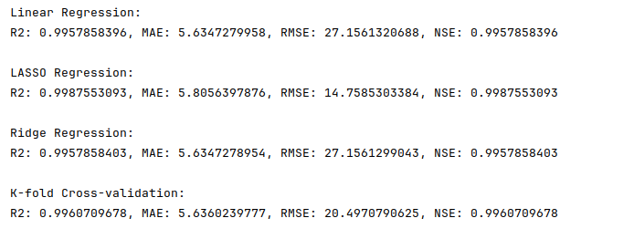

# Nội dung code

Kết quả chạy chương trình:

So sánh các mô hình hồi quy trong Machine Learning: Linear Regression, LASSO Regression, Ridge Regression qua các thông số R2, MAE, RMSE, và NSE

Thực hiện K-fold Cross-validation để đánh giá mô hình hồi quy tuyến tính

